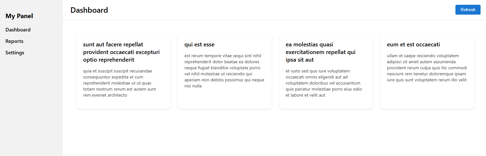

# **React Dashboard — (JavaScript Version)**

A simple and clean dashboard built with **React**, **Custom Hooks**, and **Responsive UI**, fetching real data from a public API.

## 🚀 **Demo**

👉 **[https://dashboard-nu-jade-21.vercel.app/](https://dashboard-nu-jade-21.vercel.app/)**

---

## 📌 **Features**

<<<<<<< HEAD
* Responsive dashboard layout (mobile → desktop)
* Sidebar navigation
* Header with Refresh button
* Fetching data from API using a custom hook
* Displaying posts in card components
* Clean folder structure
* Fully deployed on Vercel
=======
- Fully responsive dashboard layout (mobile → tablet → desktop)
- Sidebar navigation with **active state highlighting**
- Clean layout system using a reusable Layout component
- Page routing with **React Router**
- Beautiful icons using **react-icons**
- Header with Refresh button
- Fetching real API data using a custom hook (`useFetch`)
- Displaying posts in card components
- Organized and scalable folder structure
- Fully deployed on Vercel

---

## 🧱 **Tech Stack**

* React (JavaScript)
* CSS Modules
* Fetch API
* Vercel Deployment

---

## 📂 **Project Structure**

```
<<<<<<< HEAD
src/
 ├── components/
 │    ├── Sidebar.jsx
 │    ├── Header.jsx
 │    └── Card.jsx
 │
 ├── pages/
 │    └── Dashboard.jsx
 │
 ├── hooks/
 │    └── useFetch.js
 │
 ├── App.js
 └── index.js
```

---

## 🛠️ **How to Run Locally**

```bash
git clone https://github.com/Molana2022/dashboard.git
cd dashboard
npm install
npm start
```
---

## 📡 **API Source**

Data fetched from:
[https://jsonplaceholder.typicode.com/posts](https://jsonplaceholder.typicode.com/posts)

---

## 📸 **Screenshot**


---

## ✔️ **License**

This project is open source and available under the MIT License.

=======

src/
├── components/
│ ├── Sidebar.jsx
│ ├── Header.jsx
│ └── Card.jsx
│
├── pages/
│ ├── Dashboard.jsx
│ ├── Reports.jsx
│ └── Settings.jsx
│
├── hooks/
│ └── useFetch.js
│
├── styles/
│ ├── Card.css
│ ├── Dashboard.css
│ ├── Header.css
│ └── Sidebar.css
│
├── layout/
│ └── Layout.jsx
│
├── App.js
└── index.js
```

---

## 🛠️ **How to Run Locally**

```bash
git clone https://github.com/Molana2022/dashboard.git
cd dashboard
npm install
npm start
```

---

## 📡 **API Source**

Data fetched from:
[https://jsonplaceholder.typicode.com/posts](https://jsonplaceholder.typicode.com/posts)

---

## 📸 **Screenshot (UI Preview)**



---

## ✔️ **License**

This project is open source and available under the MIT License.

